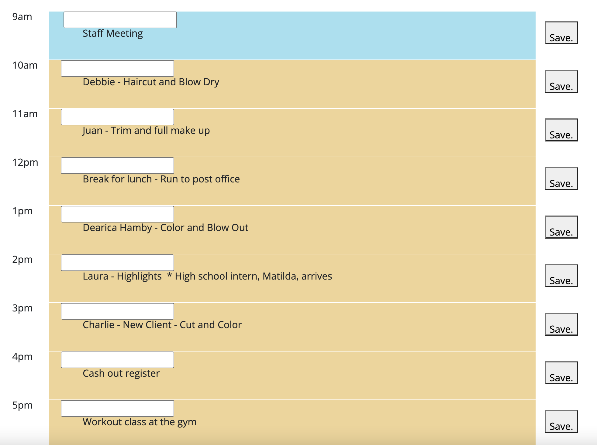
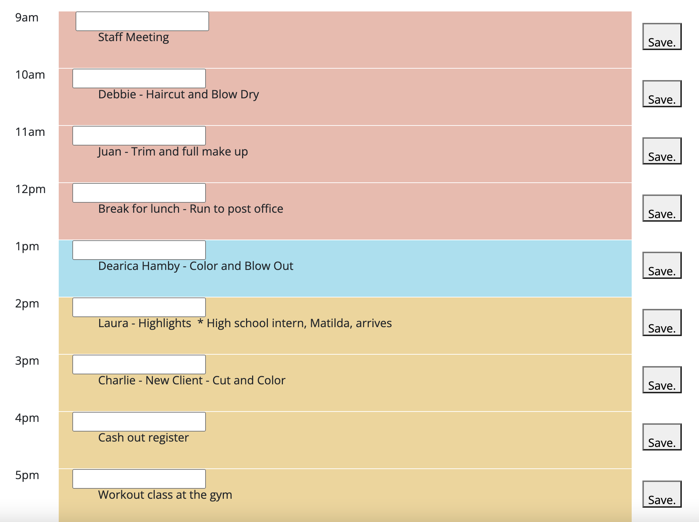
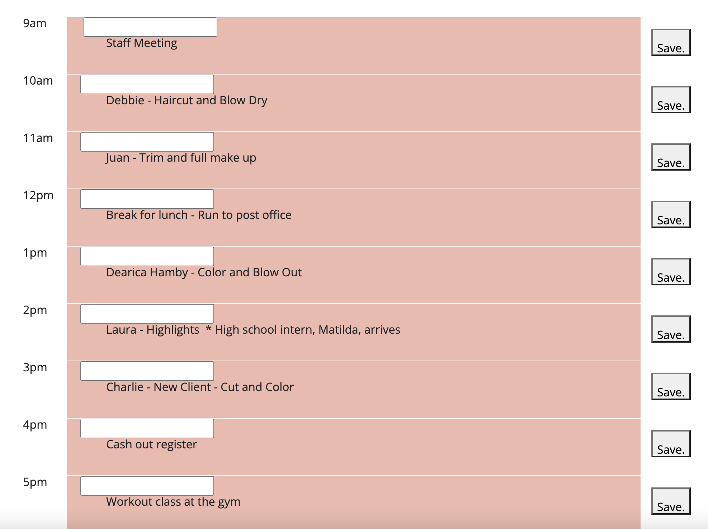

  # Daily Planner 

  
  
  ## Deployed Link
  
  [Click here!](https://duffylaura.github.io/daily-planner/)
  
  ## Description 

* This web application was designed for people with busy schedules! It allows the user to add events to a daily planner so that they can manage their schedule for the day effectively.
* While working on this project, the coder developed skills in using the Moment.js library to work with date and time, Bootstrap, and local storage. 
    
  ## Table of Contents
  - [Installation](#installation)
  - [Usage](#usage)
  - [License](#license)
  - [Contributing](#contributing)
  - [Tests](#tests)
  - [Questions](#questions)

  ## Installation

  N/A
    
  ## Usage

  As the user is planning their schedule for the day, they can write the activities that are occuring each hour from 9 to five in the daily planner app. Select the input box by the hour, enter the activities for that hour, hit the "save" button to the right. As the day goes on, the planner will be color coded. For example, at 9am a schedule for a stylist would look like this: 

    

  At 1pm, their schedule would look like this: 

    

  At the end of the day, their schedule would like this: 

    
    
  ## License

  This project is licensed under the terms of MIT license.

  For more information on this license, please visit [this link](https://opensource.org/licenses/MIT).
   
  ## Contributing 

  Interested in contributing!? There are many ways to contribute to this project. Get started [here](https://github.com/duffylaura/daily-planner).

  ## Tests 

  N/A
    
  ## Questions

  Please email lauraduffy700@gmail.com or contact me thgrough [GitHub](https://github.com/duffylaura/daily-planner).
  
